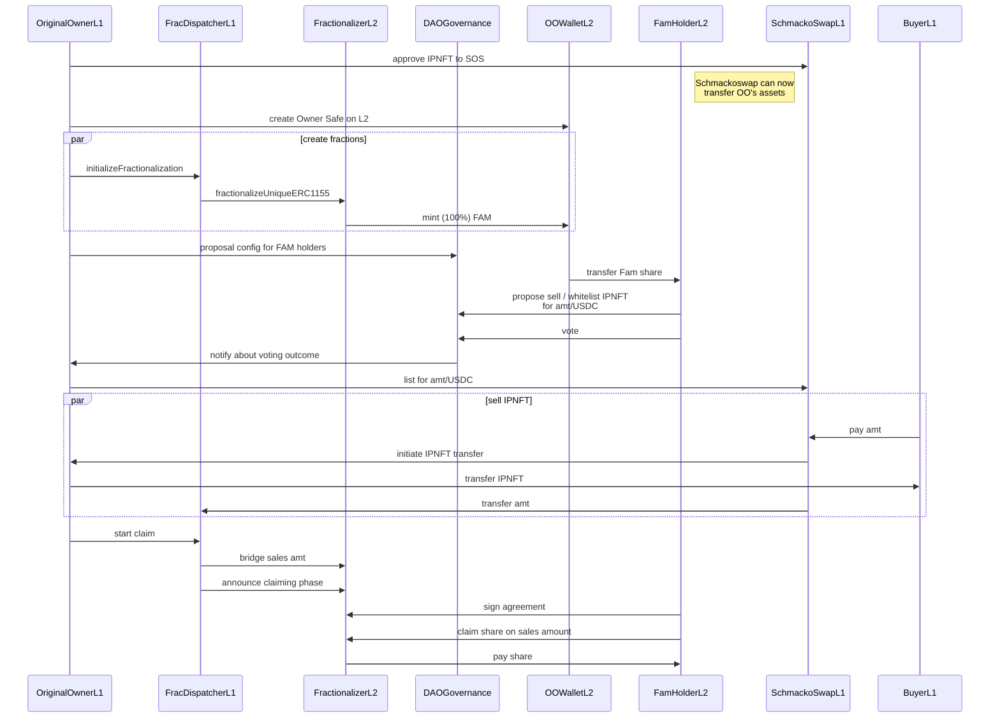

```mermaid
sequenceDiagram
    participant OO as OriginalOwnerL1
    participant FracL1 as FracDispatcherL1
    participant FX as FractionalizerL2
    %%participant XDM as XDomainMessenger
    participant Snap as DAOGovernance

    participant OOL2 as OOWalletL2
    participant FamHolder as FamHolderL2

    participant SOS as SchmackoSwapL1
    participant Buyer as BuyerL1

    OO->>SOS: approve IPNFT to SOS
    Note left of SOS: Schmackoswap can now <br> transfer OO's assets

    OO->>OOL2: create Owner Safe on L2

    par create fractions
        OO->>FracL1: initializeFractionalization
        FracL1->>FX: fractionalizeUniqueERC1155
        FX->>OOL2: mint (100%) FAM
    end

    OO->>Snap: proposal config for FAM holders

    OOL2->>FamHolder: transfer Fam share

    %% FamHolder->>FX: sign agreement
    FamHolder->>Snap: propose sell / whitelist IPNFT <br> for amt/USDC
    FamHolder->>Snap: vote
    Snap->>OO: notify about voting outcome

    OO->>SOS: list for amt/USDC

    par sell IPNFT
        Buyer->>SOS: pay amt
        SOS->>OO: initiate IPNFT transfer
        OO->>Buyer: transfer IPNFT
        SOS->>FracL1: transfer amt
    end

    OO->>FracL1: start claim
    FracL1->>FX: bridge sales amt
    FracL1->>FX: announce claiming phase

    FamHolder->>FX: sign agreement
    FamHolder->>FX: claim share on sales amount
    FX->>FamHolder: pay share


```
