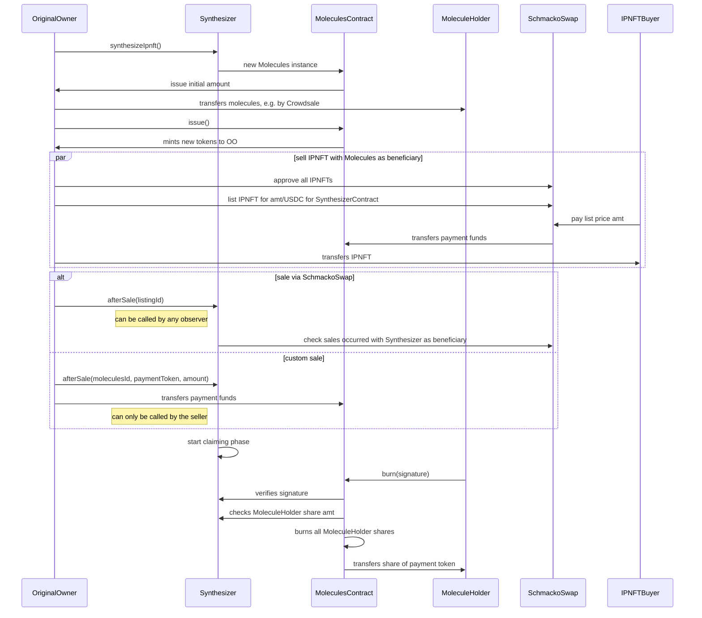

```mermaid
sequenceDiagram
    participant OO as OriginalOwner
    participant Synthesizer
    participant Molecules as MoleculesContract
    participant MoleculeHolder
    participant SOS as SchmackoSwap
    participant Buyer as IPNFTBuyer

    OO->>Synthesizer: synthesizeIpnft()
    Synthesizer->>Molecules: new Molecules instance
    Molecules->>OO: issue initial amount

    OO->>MoleculeHolder: transfers molecules, e.g. by Crowdsale

    OO->>Molecules: issue()
    Molecules->>OO: mints new tokens to OO

    par sell IPNFT with Molecules as beneficiary
        OO->>SOS: approve all IPNFTs
        OO->>SOS: list IPNFT for amt/USDC for SynthesizerContract
        Buyer->>SOS: pay list price amt
        SOS->>Molecules: transfers payment funds
        OO->>Buyer: transfers IPNFT
    end

    alt sale via SchmackoSwap
        OO->>Synthesizer: afterSale(listingId)
        Note left of Synthesizer: can be called by any observer
        Synthesizer->>SOS: check sales occurred with  Synthesizer as beneficiary
    else custom sale
        OO->>Synthesizer: afterSale(moleculesId, paymentToken, amount)
        OO->>Molecules: transfers payment funds
        Note left of Synthesizer: can only be called by the seller
    end

    Synthesizer->>Synthesizer: start claiming phase

    MoleculeHolder->>Molecules: burn(signature)
    Molecules->>Synthesizer: verifies signature
    Molecules->>Synthesizer: checks MoleculeHolder share amt
    Molecules->>Molecules: burns all MoleculeHolder shares
    Molecules->>MoleculeHolder: transfers share of payment token


```
