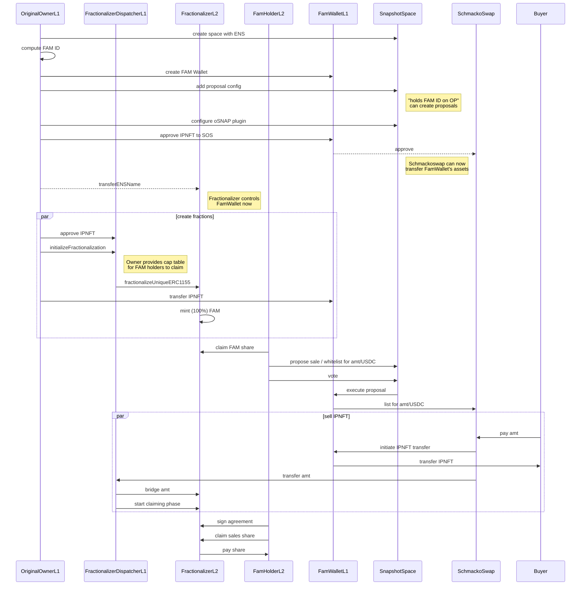

```mermaid
sequenceDiagram
    participant OO as OriginalOwnerL1
    participant FracL1 as FractionalizerDispatcherL1
    %%participant XDM as XDomainMessenger
    participant FX as FractionalizerL2
    participant FamHolder as FamHolderL2
    participant FamWallet as FamWalletL1
    participant Snap as SnapshotSpace
    participant SOS as SchmackoSwap
    participant Buyer as Buyer

    OO->>Snap: create space with ENS
    OO->>OO: compute FAM ID
    OO->>FamWallet: create FAM Wallet
    OO->>Snap: add proposal config
    Note right of Snap: "holds FAM ID on OP" <br> can create proposals
    OO->>Snap: configure oSNAP plugin
    OO->>FamWallet: approve IPNFT to SOS
    FamWallet-->>SOS: approve
    Note left of SOS: Schmackoswap can now <br> transfer FamWallet's assets

    OO-->>FX: transferENSName
    Note right of FX: Fractionalizer controls <br> FamWallet now

    par create fractions
        OO->>FracL1: approve IPNFT
        OO->>FracL1: initializeFractionalization
        Note right of FracL1: Owner provides cap table <br> for FAM holders to claim
        FracL1->>FX: fractionalizeUniqueERC1155
        OO->>FamWallet: transfer IPNFT
        FX->>FX: mint (100%) FAM
    end

    FamHolder->>FX: claim FAM share

    %% FamHolder->>FX: sign agreement
    FamHolder->>Snap: propose sale / whitelist for amt/USDC
    FamHolder->>Snap: vote

    Snap->>FamWallet: execute proposal
    FamWallet->>SOS: list for amt/USDC

    par sell IPNFT
        Buyer->>SOS: pay amt
        SOS->>FamWallet: initiate IPNFT transfer
        FamWallet->>Buyer: transfer IPNFT
        SOS->>FracL1: transfer amt
        FracL1->>FX: bridge amt
        FracL1->>FX: start claiming phase
    end

    FamHolder->>FX: sign agreement
    FamHolder->>FX: claim sales share
    FX->>FamHolder: pay share


```
