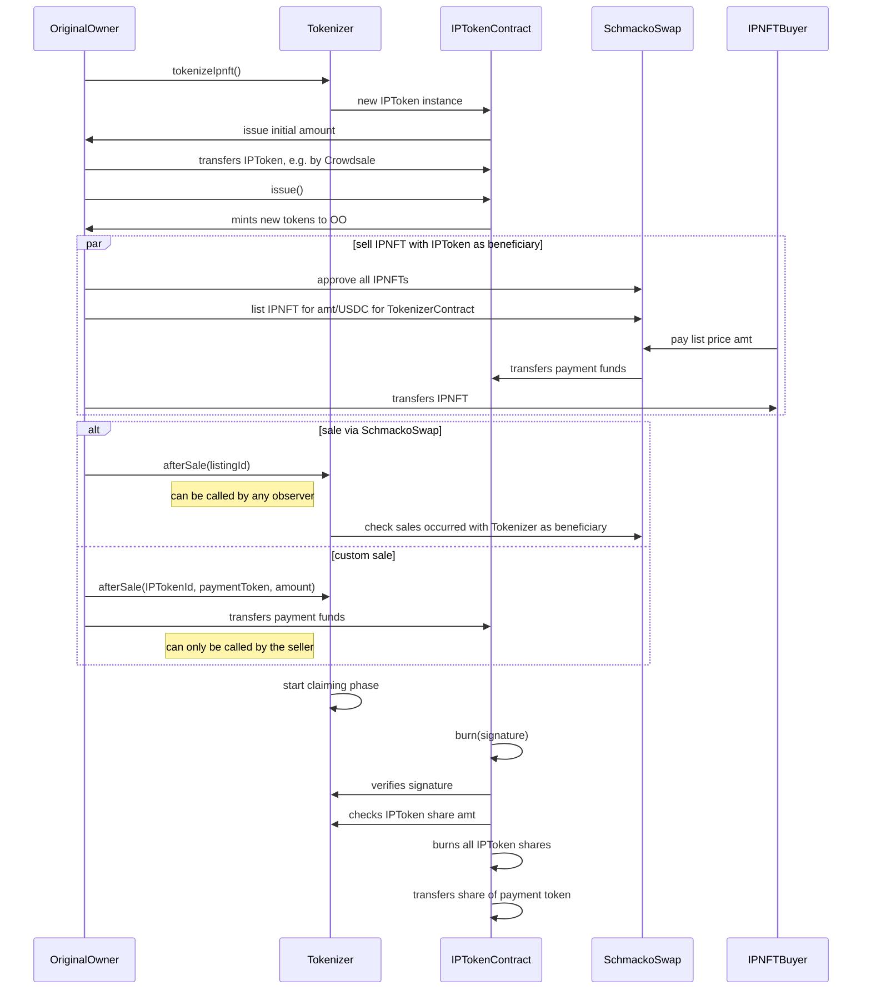

```mermaid
sequenceDiagram
    participant OO as OriginalOwner
    participant Tokenizer
    participant IPToken as IPTokenContract
    participant IPToken
    participant SOS as SchmackoSwap
    participant Buyer as IPNFTBuyer

    OO->>Tokenizer: tokenizeIpnft()
    Tokenizer->>IPToken: new IPToken instance
    IPToken->>OO: issue initial amount

    OO->>IPToken: transfers IPToken, e.g. by Crowdsale

    OO->>IPToken: issue()
    IPToken->>OO: mints new tokens to OO

    par sell IPNFT with IPToken as beneficiary
        OO->>SOS: approve all IPNFTs
        OO->>SOS: list IPNFT for amt/USDC for TokenizerContract
        Buyer->>SOS: pay list price amt
        SOS->>IPToken: transfers payment funds
        OO->>Buyer: transfers IPNFT
    end

    alt sale via SchmackoSwap
        OO->>Tokenizer: afterSale(listingId)
        Note left of Tokenizer: can be called by any observer
        Tokenizer->>SOS: check sales occurred with  Tokenizer as beneficiary
    else custom sale
        OO->>Tokenizer: afterSale(IPTokenId, paymentToken, amount)
        OO->>IPToken: transfers payment funds
        Note left of Tokenizer: can only be called by the seller
    end

    Tokenizer->>Tokenizer: start claiming phase

    IPToken->>IPToken: burn(signature)
    IPToken->>Tokenizer: verifies signature
    IPToken->>Tokenizer: checks IPToken share amt
    IPToken->>IPToken: burns all IPToken shares
    IPToken->>IPToken: transfers share of payment token


```
