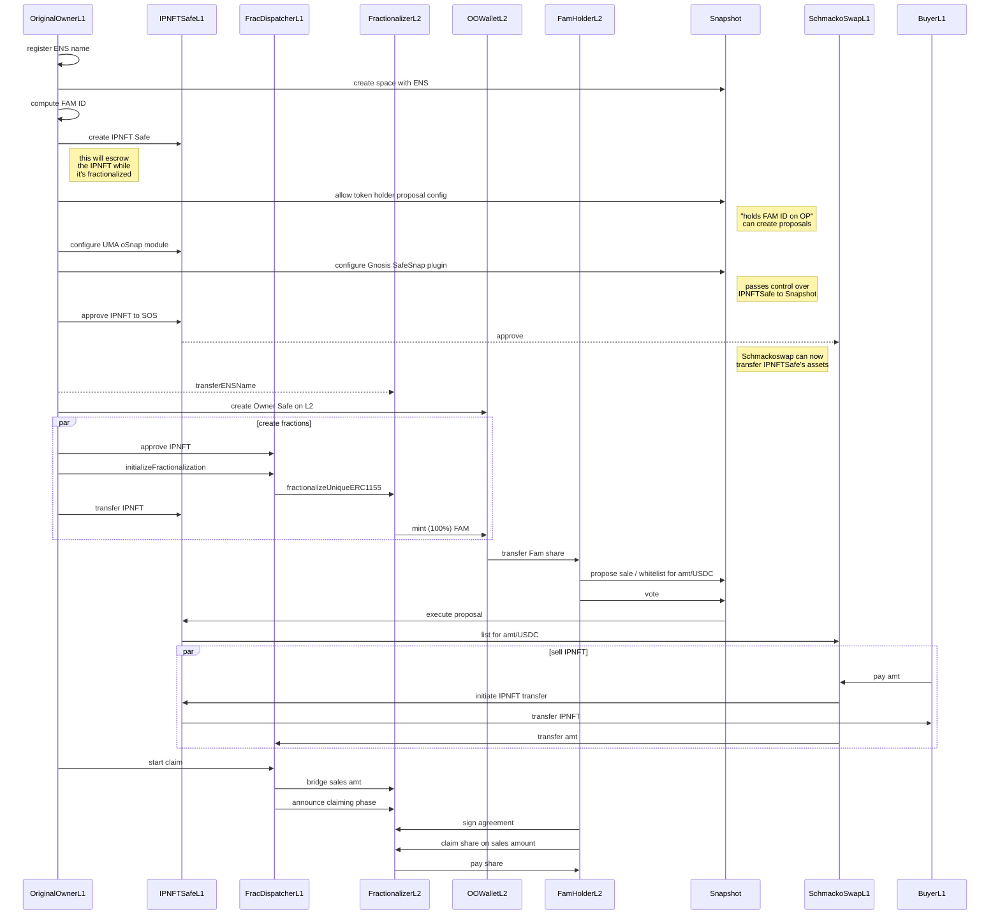

```mermaid
sequenceDiagram
    participant OO as OriginalOwnerL1
    participant IPNFTSafe as IPNFTSafeL1
    participant FracL1 as FracDispatcherL1
    participant FX as FractionalizerL2
    %%participant XDM as XDomainMessenger

    participant OOL2 as OOWalletL2

    participant FamHolder as FamHolderL2
    participant Snap as Snapshot
    participant SOS as SchmackoSwapL1
    participant Buyer as BuyerL1

    OO->>OO: register ENS name
    OO->>Snap: create space with ENS
    OO->>OO: compute FAM ID

    OO->>IPNFTSafe: create IPNFT Safe
    Note right of OO: this will escrow<br> the IPNFT while <br> it's fractionalized
    OO->>Snap: allow token holder proposal config
    Note right of Snap: "holds FAM ID on OP" <br> can create proposals

    OO->>IPNFTSafe: configure UMA oSnap module
    OO->>Snap: configure Gnosis SafeSnap plugin
    Note right of Snap: passes control over <br> IPNFTSafe to Snapshot

    OO->>IPNFTSafe: approve IPNFT to SOS
    IPNFTSafe-->>SOS: approve
    Note left of SOS: Schmackoswap can now <br> transfer IPNFTSafe's assets

    OO-->>FX: transferENSName

    OO->>OOL2: create Owner Safe on L2

    par create fractions
        OO->>FracL1: approve IPNFT
        OO->>FracL1: initializeFractionalization
        FracL1->>FX: fractionalizeUniqueERC1155
        OO->>IPNFTSafe: transfer IPNFT
        FX->>OOL2: mint (100%) FAM
    end

    OOL2->>FamHolder: transfer Fam share

    %% FamHolder->>FX: sign agreement
    FamHolder->>Snap: propose sale / whitelist for amt/USDC
    FamHolder->>Snap: vote

    Snap->>IPNFTSafe: execute proposal
    IPNFTSafe->>SOS: list for amt/USDC

    par sell IPNFT
        Buyer->>SOS: pay amt
        SOS->>IPNFTSafe: initiate IPNFT transfer
        IPNFTSafe->>Buyer: transfer IPNFT
        SOS->>FracL1: transfer amt
    end

    OO->>FracL1: start claim
    FracL1->>FX: bridge sales amt
    FracL1->>FX: announce claiming phase

    FamHolder->>FX: sign agreement
    FamHolder->>FX: claim share on sales amount
    FX->>FamHolder: pay share


```
