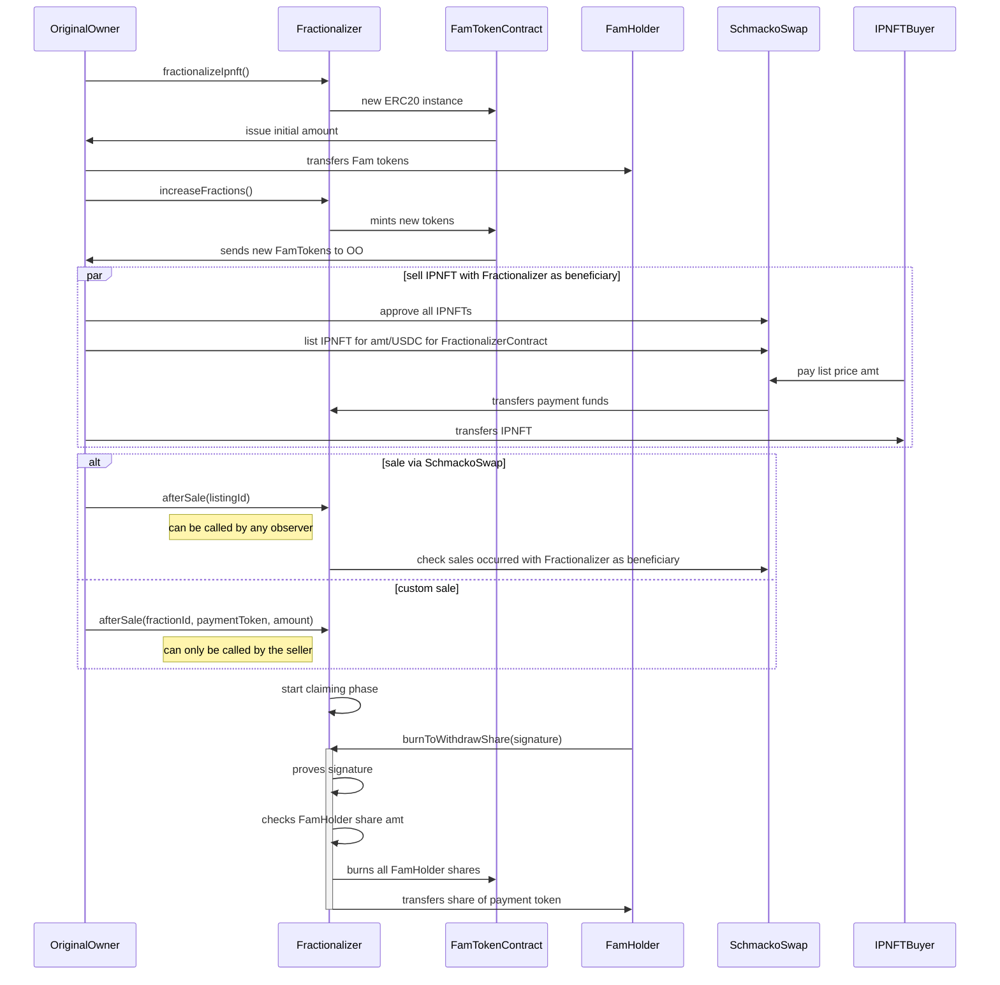

```mermaid
sequenceDiagram
    participant OO as OriginalOwner
    participant Fractionalizer
    participant FamToken as FamTokenContract
    participant FamHolder
    participant SOS as SchmackoSwap
    participant Buyer as IPNFTBuyer

    OO->>Fractionalizer: fractionalizeIpnft()
    Fractionalizer->>FamToken: new ERC20 instance
    FamToken->>OO: issue initial amount

    OO->>FamHolder: transfers Fam tokens

    OO->>Fractionalizer: increaseFractions()
    Fractionalizer->>FamToken: mints new tokens
    FamToken->>OO: sends new FamTokens to OO

    par sell IPNFT with Fractionalizer as beneficiary
        OO->>SOS: approve all IPNFTs
        OO->>SOS: list IPNFT for amt/USDC for FractionalizerContract
        Buyer->>SOS: pay list price amt
        SOS->>Fractionalizer: transfers payment funds
        OO->>Buyer: transfers IPNFT
    end

    alt sale via SchmackoSwap
        OO->>Fractionalizer: afterSale(listingId)
        Note left of Fractionalizer: can be called by any observer
        Fractionalizer->>SOS: check sales occurred with  Fractionalizer as beneficiary
    else custom sale
        OO->>Fractionalizer: afterSale(fractionId, paymentToken, amount)
        Note left of Fractionalizer: can only be called by the seller
    end

    Fractionalizer->>Fractionalizer: start claiming phase

    FamHolder->>Fractionalizer: burnToWithdrawShare(signature)
    activate Fractionalizer
    Fractionalizer->>Fractionalizer: proves signature
    Fractionalizer->>Fractionalizer: checks FamHolder share amt
    Fractionalizer->>FamToken: burns all FamHolder shares
    Fractionalizer->>FamHolder: transfers share of payment token
    deactivate Fractionalizer

```
